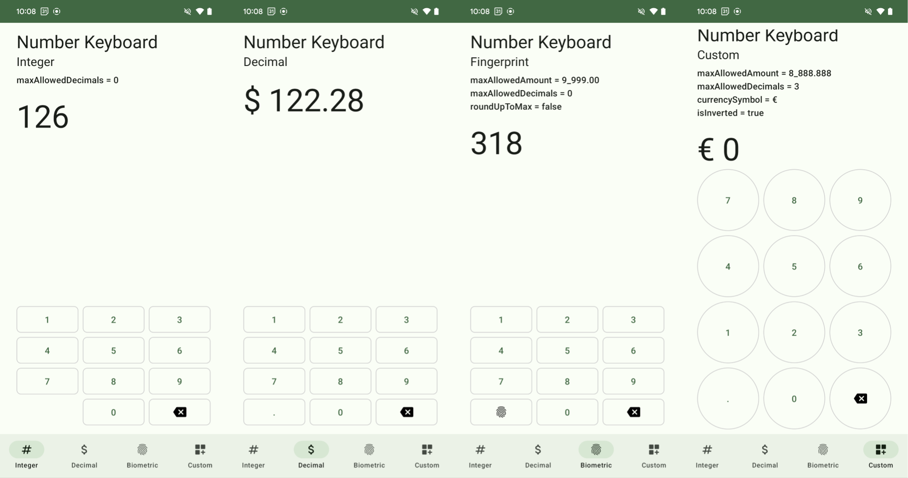

# Number Keyboard  [](https://jitpack.io/#davidmigloz/number-keyboard)

Android library that provides a number keyboard composable.



## Usage

### Step 1

Add the JitPack repository to your `build.gradle` file:

```gradle
allprojects {
	repositories {
		...
		maven { url "https://jitpack.io" }
	}
}
```

### Step 2

Add the dependency:

```gradle
dependencies {
        implementation 'com.github.davidmigloz:number-keyboard:4.0.7'
}
```

[CHANGELOG](https://github.com/davidmigloz/number-keyboard/blob/master/CHANGELOG.md)

> **Note:** in v4.0.0 the library was migrated to Jetpack Compose. If you need to old Android View based version, please keep using [v3.1.0](https://github.com/davidmigloz/number-keyboard/tree/3.1.0) instead.

### Step 3

#### Use `NumberKeyboard` Composable in your layout:

```kotlin
NumberKeyboard(
  maxAllowedAmount = 999.00,
  maxAllowedDecimals = 0,
  roundUpToMax = false,
  button = { number, clickedListener ->
    NumberKeyboardButton(
      modifier = buttonModifier,
      textStyle = buttonTextStyle,
      number = number,
      listener = clickedListener
    )
  },
  leftAuxButton = { _ ->
    NumberKeyboardAuxButton(
      modifier = buttonModifier,
      textStyle = buttonTextStyle,
      imageVector = Icons.Rounded.Fingerprint,
      clicked = { Toast.makeText(context, "Triggered", Toast.LENGTH_SHORT).show() }
    )
  },
  rightAuxButton = { clickedListener ->
    NumberKeyboardAuxButton(
      modifier = buttonModifier,
      textStyle = buttonTextStyle,
      imageVector = Icons.Rounded.Backspace,
      iconTint = MaterialTheme.colorScheme.primary,
      clicked = { clickedListener.onRightAuxButtonClicked() }
    )
  },
  listener = object : NumberKeyboardListener {
    override fun onUpdated(data: NumberKeyboardData) {
      text = data.int.toString()
    }
  }
)
```

##### Attribute

- `initialAmount` - Double (default: 0.0): Initial amount for `NumberKeyboard` output
- `maxAllowedAmount` - Double (default: 10_000.0): Maximum amount allowed for the `NumberKeyboard` output
- `maxAllowedDecimals` - Int (default: 2): Maximum decimal points allowed for the `NumberKeyboard` output
- `currencySymbol` - String (default: "$"): Currency symbol for the `NumberKeyboardData` currency format output
- `isInverted` - Boolean (default: false): Default number sequence is the phone number pad sequence, inverted is the calculator number pad sequence
- `roundUpToMax` - Boolean (default: true): Behaviour to round up to the max allowed amount if amount has exceeded
- `verticalArrangement` - Arrangement.HorizontalOrVertical (default: 8.dp): Vertical spacing between the buttons
- `horizontalArrangement` - Arrangement.HorizontalOrVertical (default: 8.dp): Horizontal spacing between the buttons
- `decimalSeparator` - Char (default: DecimalFormat.decimalFormatSymbols.decimalSeparator): Character for decimal separator
- `groupingSeparator` - Char (default: DecimalFormat.decimalFormatSymbols.groupingSeparator): Character for grouping separator

##### Composable 

To harness the power and flexibility of Jetpack Compose, `NumberKeyboard` now provides `@Composable` lambdas that gives you control over all the button layouts.
Thus, you can easily customise it with shadows, different shapes or even different locales!

1) `button: @Composable (Int, NumberKeyboardClickedListener) -> Unit,`
- `value` - Int: Number of the button pressed
- `listener` - NumberKeyboardClickedListener: Click listener for all buttons, left aux button and right aux button if applicable.

2) `leftAuxButton, rightAuxButton: @Composable ((NumberKeyboardClickedListener) -> Unit)? = null`
- `listener` - NumberKeyboardClickedListener: Click listener for all buttons, left aux button and right aux button if applicable.

For `NumberKeyboardClickedListener`, it is a click listener for all buttons in `NumberKeyboard`. 
Inside `NumberKeyboard`, there is a `NumberKeyboardClickedListener` instance that will be used to format the output through `NumberKeyboardListener`.

If you wish to have more control, you can easily just have a `NumberKeyboardClickedListener` at your Fragment level.

```kotlin
interface NumberKeyboardClickedListener {
    fun onNumberClicked(number: Int)
    fun onLeftAuxButtonClicked()
    fun onRightAuxButtonClicked()
}
```

There is an out-of-box `NumberKeyboardButton` that you can use to quickly get started, it's basically a wrapped `OutlineButton.Text`.

```kotlin
@Composable
fun NumberKeyboardButton(
    modifier: Modifier,
    textStyle: TextStyle,
    shape: Shape = RoundedCornerShape(size = 8.dp),
    haptics: HapticFeedback = LocalHapticFeedback.current,
    number: Int,
    listener: NumberKeyboardClickedListener
) {
    OutlinedButton(
        modifier = modifier,
        shape = shape,
        border = BorderStroke(1.dp, Color.LightGray),
        onClick = {
            haptics.performHapticFeedback(HapticFeedbackType.LongPress)
            listener.onNumberClicked(number)
        }
    ) {
        Text(
            text = number.toString(),
            style = textStyle
        )
    }
}
```

##### NumberKeyboardListener

This listener is _optional_, but if you want to utilise this. Make sure that the `NumberKeyboardClickedListener` is configured properly when you are building your button layouts.
After configuration, it will provide `NumberKeyboardData` that has the `rawAmount` from the `NumberKeyboard` inout and it's variation of Integer and Float variable types.  

```kotlin
interface NumberKeyboardListener {
    fun onUpdated(data: NumberKeyboardData)
}

class NumberKeyboardData(
  amount: String,
  private val decimalSeparator: Char,
  private val groupingSeparator: Char,
  private val currencySymbol: String
) {
  val rawAmount: String = amount.ifEmpty { "0" }

  // Integer
  val byte: Byte
    get() = rawAmount.normaliseNumber().toInt().toByte()

  val short: Short
    get() = rawAmount.normaliseNumber().toInt().toShort()

  val int: Int
    get() = rawAmount.normaliseNumber().toInt()

  val long: Long
    get() = rawAmount.normaliseNumber().toLong()

  // Floating-point
  val float: Float
    get() = rawAmount.normaliseNumber().toFloat()

  val double: Double
    get() = rawAmount.normaliseNumber()

  val currency: String
    get() = formatCurrency(rawAmount, decimalSeparator, groupingSeparator, currencySymbol)
}
```

##### Examples

1) Integer `NumberKeyboard`
  [Sample](https://github.com/davidmigloz/number-keyboard/blob/master/sample/src/main/java/com/davidmiguel/sample/IntegerScreen.kt)

```kotlin
val maxAllowedDecimals: Int = 0
```

2) Decimal `NumberKeyboard`
   [Sample](https://github.com/davidmigloz/number-keyboard/blob/master/sample/src/main/java/com/davidmiguel/sample/DecimalScreen.kt)

```kotlin
val maxAllowedAmount: Double = 10_000.00
val maxAllowedDecimals: Int = 2
val currencySymbol: String = "$"
```

3) Biometric `NumberKeyboard`
   [Sample](https://github.com/davidmigloz/number-keyboard/blob/master/sample/src/main/java/com/davidmiguel/sample/BiometricScreen.kt)

```kotlin
val maxAllowedAmount: Double = 9_999.0
val maxAllowedDecimals: Int = 0
val roundUpToMax: Boolean = false
```

4) Custom `NumberKeyboard`
   [Sample](https://github.com/davidmigloz/number-keyboard/blob/master/sample/src/main/java/com/davidmiguel/sample/CustomScreen.kt)

```kotlin
val maxAllowedAmount: Double = 8_888.88
val maxAllowedDecimals: Int = 3
val currencySymbol: String = "€"
val isInverted: Boolean = true
```

---

#### Use `NumberKeyboard` AndroidView <= [v3.1.0](https://github.com/davidmigloz/number-keyboard/tree/3.1.0) XML view  in your layout:

```xml
<com.davidmiguel.numberkeyboard.NumberKeyboard
    xmlns:android="http://schemas.android.com/apk/res/android"
    xmlns:keyboard="http://schemas.android.com/apk/res-auto"
    ...
    keyboard:numberkeyboard_keyboardType="integer"
    ... />
```

##### Attributes

- `keyboard:numberkeyboard_keyboardType="[integer|decimal|fingerprint|custom]"` (required): defines the type of keyboard.
    - `integer`: numbers and backspace keys.
    - `decimal`: numbers, comma and backspace keys.
    - `fingerprint`: numbers, fingerprint and backspace keys.
    - `custom`: numbers and defined auxiliary keys.
- `keyboard:numberkeyboard_keyWidth="[dimension]"` (default: `match_parent`): key width (`wrap_content` not allowed).
- `keyboard:numberkeyboard_keyHeight="[dimension]"` (default: `match_parent`): key height (`wrap_content` not allowed).
- `keyboard:numberkeyboard_keyPadding="[dimension]"` (default: `16dp`): key padding.
- `keyboard:numberkeyboard_numberKeyBackground="[reference]"` (default: circle): number keys background drawable.
- `keyboard:numberkeyboard_numberKeyTextColor="[reference]"` (default: dark blue): number keys text color.
- `keyboard:numberkeyboard_numberKeyTypeface="[reference]"` (default: dark blue): number keys text color.
- `keyboard:numberkeyboard_numberKeyTypeface="[reference]"` (default: none): number keys text typeface.
- `keyboard:numberkeyboard_numberKeyTextSize="[dimension]"` (default: none): number keys text size (if it is not set, the text auto scales to fit the key).
- `keyboard:numberkeyboard_leftAuxBtnBackground="[reference]"` (default: none): if `keyboardType="custom"`, left auxiliary button background.
- `keyboard:numberkeyboard_rightAuxBtnIcon="[reference]"` (default: none): if `keyboardType="custom"`, icon shown in right auxiliary button.
- `keyboard:numberkeyboard_rightAuxBtnBackground="[reference]"` (default: none): if `keyboardType="custom"`, right auxiliary button background.

##### Methods

- `hideLeftAuxButton()`: hides left auxiliary button.
- `showLeftAuxButton()`: shows left auxiliary button.
- `hideRightAuxButton()`: hides right auxiliary button.
- `showRightAuxButton()`: shows right auxiliary button.
- `setKeyWidth()`: sets key width in px.
- `setKeyHeight()`: sets key height in px.
- `setKeyPadding()`: sets key padding in px.
- `setNumberKeyBackground()`: sets number keys background.
- `setNumberKeyTextColor()`: sets number keys text color.
- `setNumberKeyTypeface()`: sets number keys text typeface.
- `setNumberKeyTextSize()`: sets number keys text size in pixels.
- `setLeftAuxButtonIcon()`: sets left auxiliary button icon.
- `setRightAuxButtonIcon()`: sets right auxiliary button icon.
- `setLeftAuxButtonBackground()`: sets left auxiliary button background.
- `setRightAuxButtonBackground()`: sets right auxiliary button background.

##### Callback

To listen to keyboard events, you have to use `NumberKeyboardListener`:

- `onNumberClicked()`: invoked when a number key is clicked.
- `onLeftAuxButtonClicked()`: invoked when the left auxiliary button is clicked.
- `onRightAuxButtonClicked()`: invoked when the right auxiliary button is clicked.

```kotlin
 numberKeyboard.setListener(object: NumberKeyboardListener {
    override fun onNumberClicked(number: Int) {
        ...
    }

    override fun onLeftAuxButtonClicked() {
        ...
    }

    override fun onRightAuxButtonClicked() {
        ...
    }
})
```


Take a look at the [sample app](https://github.com/davidmigloz/number-keyboard/tree/master/sample) to see the library working.

## Contributing

If you find any issues or you have any questions, ideas... feel free to [open an issue](https://github.com/davidmigloz/number-keyboard/issues/new).
Pull request are very appreciated.

## License

Copyright (c) 2023 David Miguel Lozano / Morgan Koh

Licensed under the Apache License, Version 2.0 (the "License");
you may not use this file except in compliance with the License.
You may obtain a copy of the License at

http://www.apache.org/licenses/LICENSE-2.0

Unless required by applicable law or agreed to in writing, software
distributed under the License is distributed on an "AS IS" BASIS,
WITHOUT WARRANTIES OR CONDITIONS OF ANY KIND, either express or implied.
See the License for the specific language governing permissions and
limitations under the License.
