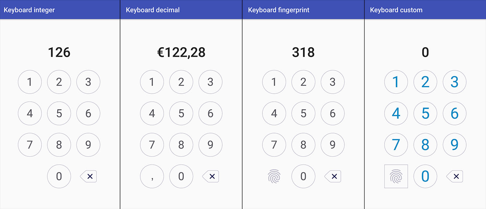

# Number Keyboard  [](https://jitpack.io/#davidmigloz/number-keyboard)

Android library that provides a number keyboard view.



## Usage

#### Step 1

Add the JitPack repository to your `build.gradle ` file:

```gradle
allprojects {
	repositories {
		...
		maven { url "https://jitpack.io" }
	}
}
```

#### Step 2

Add the dependency:

```gradle
dependencies {
	compile 'com.github.davidmigloz:number-keyboard:0.1'
}
```

#### Step 3

Use `NumberKeyboard` view in your layout:

```xml
<com.davidmiguel.numberkeyboard.NumberKeyboard
    xmlns:android="http://schemas.android.com/apk/res/android"
    xmlns:keyboard="http://schemas.android.com/apk/res-auto"
    ...
    keyboard:keyboardType="integer"
    ... />
```

#### Attributes

- `keyboard:keyboardType="[integer|decimal|fingerprint|custom]"` (required): defines the type of keyboard.
  - `integer`: numbers and backspace keys.
  - `decimal`: numbers, comma and backspace keys.
  - `fingerprint`: numbers, fingerprint and backspace keys.
  - `custom`: numbers and defined auxiliary keys.
- `keyboard:keyHeight="[dimension]"` (default: 70dp): key height.
- `keyboard:numberKeyBackground="[reference]"` (default: circle): number keys background drawable.
- `keyboard:numberKeyTextSize="[dimension]"` (default: 32sp): number keys text size.
- `keyboard:numberKeyTextColor="[reference]"` (default: dark blue): number keys text color.
- `keyboard:leftAuxBtnIcon="[reference]"` (default: none): if `keyboardType="custom"`, icon shown in left auxiliary button.
- `keyboard:leftAuxBtnBackground="[reference]"` (default: none): if `keyboardType="custom"`, left auxiliary button background.
- `keyboard:rightAuxBtnIcon="[reference]"` (default: none): if `keyboardType="custom"`, icon shown in right auxiliary button.
- `keyboard:rightAuxBtnBackground="[reference]"` (default: none): if `keyboardType="custom"`, right auxiliary button background.  

#### Methods

- `hideLeftAuxButton()`: hides left auxiliary button.
- `showLeftAuxButton()`: shows left auxiliary button.
- `hideRightAuxButton()`: hides right auxiliary button.
- `showRightAuxButton()`: shows right auxiliary button.
- `setKeyWidth()`: sets key width in px.
- `setKeyHeight()`: sets key height in px.
- `setNumberKeyBackground()`: sets number keys background.
- `setNumberKeyTextSize()`: sets number keys text size.
- `setNumberKeyTextColor()`: sets number keys text color.
- `setNumberKeyTypeface()`: sets number keys text typeface.
- `setLeftAuxButtonIcon()`: sets left auxiliary button icon.
- `setRightAuxButtonIcon()`: sets right auxiliary button icon.
- `setLeftAuxButtonBackground()`: sets left auxiliary button background.
- `setRightAuxButtonBackground()`: sets right auxiliary button background.

#### Callback

To listen to keyboard events, you have to use `NumberKeyboardListener`:

- `onNumberClicked()`: invoked when a number key is clicked.
- `onLeftAuxButtonClicked()`: invoked when the left auxiliary button is clicked.
- `onRightAuxButtonClicked()`: invoked when the right auxiliary button is clicked.

```java
numberKeyboard.setListener(new NumberKeyboardListener() {
     @Override
     public void onNumberClicked(int number) {...}

     @Override
     public void onLeftAuxButtonClicked() {...}

     @Override
     public void onRightAuxButtonClicked() {...}
});
```

Take a look at the [sample app](https://github.com/davidmigloz/number-keyboard/tree/master/sample) to see the library working.

## Contributing

If you find any issues or you have any questions, ideas... feel free to [open an issue](https://github.com/davidmigloz/number-keyboard/issues/new).
Pull request are very appreciated.

## License

Copyright (c) 2017 David Miguel Lozano

Licensed under the Apache License, Version 2.0 (the "License");
you may not use this file except in compliance with the License.
You may obtain a copy of the License at

http://www.apache.org/licenses/LICENSE-2.0

Unless required by applicable law or agreed to in writing, software
distributed under the License is distributed on an "AS IS" BASIS,
WITHOUT WARRANTIES OR CONDITIONS OF ANY KIND, either express or implied.
See the License for the specific language governing permissions and
limitations under the License.
