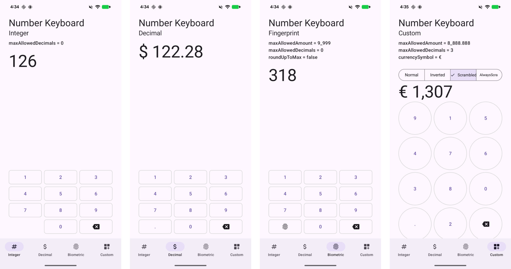
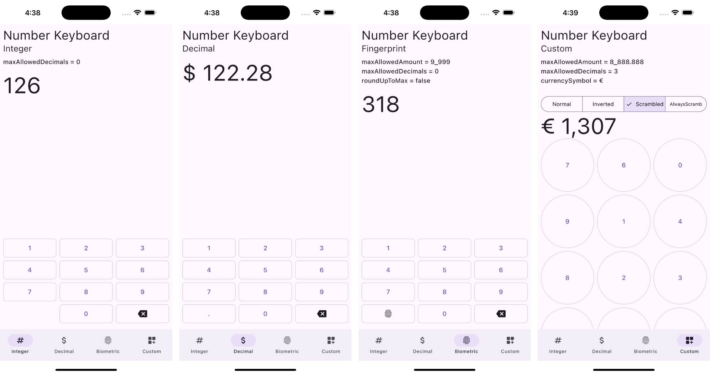
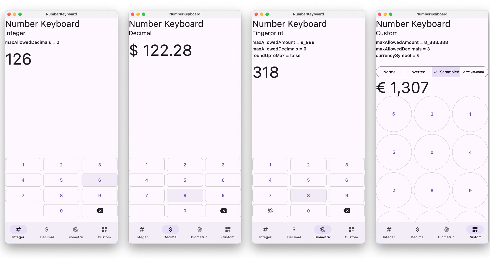

# Number Keyboard  [](https://jitpack.io/#davidmigloz/number-keyboard)

KMP library that provides a number keyboard composable.

**Android**


**iOS**


**Desktop**


## Usage

### Step 1

Add the JitPack repository to your `build.gradle` file:

```gradle
allprojects {
	repositories {
		...
		maven { url "https://jitpack.io" }
	}
}
```

### Step 2

Add the dependency:

```gradle
dependencies {
    implementation 'com.github.davidmigloz:number-keyboard:5.0.2'
}
```

[CHANGELOG](https://github.com/davidmigloz/number-keyboard/blob/master/CHANGELOG.md)

- v5.0.0: Migrated to Kotlin Multiplatform (Android, iOS, Desktop).
- v4.0.0: Migrated to Jetpack Compose. Use v3 for the old Android View-based version.
- v3.0.0: Migrated to Kotlin.

### Step 3

#### Use `NumberKeyboard` Composable in your layout:

```kotlin
var amountWithCurrency by remember { mutableStateOf("$currencySymbol 0") }
var amount by remember { mutableStateOf("") }

NumberKeyboard(
    amount = amount,
    maxAllowedAmount = 999.00,
    maxAllowedDecimals = 0,
    roundUpToMax = false,
    button = { number, clickedListener ->
        NumberKeyboardButton(
            modifier = buttonModifier,
            textStyle = buttonTextStyle,
            number = number,
            listener = clickedListener
        )
    },
    leftAuxButton = { _ ->
        NumberKeyboardAuxButton(
            modifier = buttonModifier,
            textStyle = buttonTextStyle,
            imageVector = Icons.Rounded.Fingerprint,
            clicked = { Toast.makeText(context, "Triggered", Toast.LENGTH_SHORT).show() }
        )
    },
    rightAuxButton = { clickedListener ->
        NumberKeyboardAuxButton(
            modifier = buttonModifier,
            textStyle = buttonTextStyle,
            imageVector = Icons.Rounded.Backspace,
            iconTint = MaterialTheme.colorScheme.primary,
            clicked = { clickedListener.onRightAuxButtonClicked() }
        )
    },
    listener = object : NumberKeyboardListener {
        override fun onUpdated(data: NumberKeyboardData) {
          amountWithCurrency = data.currency
          amount = data.rawAmount
        }
    }
)
```

##### Attribute

- `amount` - String: Variable that keeps
- `maxAllowedAmount` - Double (default: 10_000.0): Maximum amount allowed for the `NumberKeyboard`
  output
- `maxAllowedDecimals` - Int (default: 2): Maximum decimal points allowed for the `NumberKeyboard`
  output
- `currencySymbol` - String (default: "$"): Currency symbol for the `NumberKeyboardData` currency
- `format` Enum(default: NumberKeyboardFormat.Normal) Defines the layout of the number pad. Options:
  • Normal: Standard ascending layout (1–9 top to bottom, like a phone dial pad).
  • Inverted: Descending layout (9–1 top to bottom, like a calculator).
  • Scrambled: Digits are shuffled once at composition.
  • AlwaysScrambled: Digits reshuffle every time the user taps a key — great for max security or
  mild chaos.
- `roundUpToMax` - Boolean (default: true): Behaviour to round up to the max allowed amount if
  amount has exceeded
- `verticalArrangement` - Arrangement.HorizontalOrVertical (default: 8.dp): Vertical spacing between
  the buttons
- `horizontalArrangement` - Arrangement.HorizontalOrVertical (default: 8.dp): Horizontal spacing
  between the buttons
- `decimalSeparator` - Char (default: DecimalFormat.decimalFormatSymbols.decimalSeparator):Character
  for decimal separator
- `groupingSeparator` - Char (default: DecimalFormat.decimalFormatSymbols.groupingSeparator):
  Character for grouping separator

##### Composable

To harness the power and flexibility of Jetpack Compose, `NumberKeyboard` now provides `@Composable`
lambdas that gives you control over all the button layouts.
Thus, you can easily customise it with shadows, different shapes or even different locales!

1) `button: @Composable (Int, NumberKeyboardClickedListener) -> Unit,`

- `value` - Int: Number of the button pressed
- `listener` - NumberKeyboardClickedListener: Click listener for all buttons, left aux button and
  right aux button if applicable.

2) `leftAuxButton, rightAuxButton: @Composable ((NumberKeyboardClickedListener) -> Unit)? = null`

- `listener` - NumberKeyboardClickedListener: Click listener for all buttons, left aux button and
  right aux button if applicable.

For `NumberKeyboardClickedListener`, it is a click listener for all buttons in `NumberKeyboard`.
Inside `NumberKeyboard`, there is a `NumberKeyboardClickedListener` instance that will be used to
format the output through `NumberKeyboardListener`.

If you wish to have more control, you can easily just have a `NumberKeyboardClickedListener` at your
Fragment level.

```kotlin
interface NumberKeyboardClickedListener {
    fun onNumberClicked(number: Int)
    fun onLeftAuxButtonClicked()
    fun onRightAuxButtonClicked()
}
```

There is an out-of-box `NumberKeyboardButton` that you can use to quickly get started, it's
basically a wrapped `OutlineButton.Text`.

```kotlin
@Composable
fun NumberKeyboardButton(
    modifier: Modifier,
    textStyle: TextStyle,
    shape: Shape = RoundedCornerShape(size = 8.dp),
    haptics: HapticFeedback = LocalHapticFeedback.current,
    number: Int,
    listener: NumberKeyboardClickedListener
) {
    OutlinedButton(
        modifier = modifier,
        shape = shape,
        border = BorderStroke(1.dp, Color.LightGray),
        onClick = {
            haptics.performHapticFeedback(HapticFeedbackType.LongPress)
            listener.onNumberClicked(number)
        }
    ) {
        Text(
            text = number.toString(),
            style = textStyle
        )
    }
}
```

`NumberKeyboardAuxButton` provides the default look for the auxiliary keys. It
now accepts `colors` and `iconTint` so you can customise the delete button and
other icons:

```kotlin
@Composable
fun NumberKeyboardAuxButton(
    modifier: Modifier,
    textStyle: TextStyle,
    shape: Shape = RoundedCornerShape(size = 8.dp),
    haptics: HapticFeedback = LocalHapticFeedback.current,
    value: String? = null,
    imageVector: ImageVector? = null,
    clicked: () -> Unit,
    colors: ButtonColors = ButtonDefaults.outlinedButtonColors(),
    iconTint: Color = LocalContentColor.current
)
```

##### NumberKeyboardListener

This listener is _optional_, but if you want to utilise this. Make sure that the
`NumberKeyboardClickedListener` is configured properly when you are building your button layouts.
After configuration, it will provide `NumberKeyboardData` that has the `rawAmount` from the
`NumberKeyboard` inout and it's variation of Integer and Float variable types.

```kotlin
interface NumberKeyboardListener {
    fun onUpdated(data: NumberKeyboardData)
}

class NumberKeyboardData(
    amount: String,
    private val decimalSeparator: Char,
    private val groupingSeparator: Char,
    private val currencySymbol: String
) {
    val rawAmount: String = amount.ifEmpty { "0" }

    // Integer
    val byte: Byte
        get() = rawAmount.normaliseNumber().toInt().toByte()

    val short: Short
        get() = rawAmount.normaliseNumber().toInt().toShort()

    val int: Int
        get() = rawAmount.normaliseNumber().toInt()

    val long: Long
        get() = rawAmount.normaliseNumber().toLong()

    // Floating-point
    val float: Float
        get() = rawAmount.normaliseNumber().toFloat()

    val double: Double
        get() = rawAmount.normaliseNumber()

    val currency: String
        get() = formatCurrency(rawAmount, decimalSeparator, groupingSeparator, currencySymbol)
}
```

##### Examples

1) Integer `NumberKeyboard`
   [Sample](https://github.com/davidmigloz/number-keyboard/blob/master/sample/src/main/java/com/davidmiguel/sample/IntegerScreen.kt)

```kotlin
val maxAllowedDecimals: Int = 0
```

2) Decimal `NumberKeyboard`
   [Sample](https://github.com/davidmigloz/number-keyboard/blob/master/sample/src/main/java/com/davidmiguel/sample/DecimalScreen.kt)

```kotlin
val maxAllowedAmount: Double = 10_000.00
val maxAllowedDecimals: Int = 2
val currencySymbol: String = "$"
```

3) Biometric `NumberKeyboard`
   [Sample](https://github.com/davidmigloz/number-keyboard/blob/master/sample/src/main/java/com/davidmiguel/sample/BiometricScreen.kt)

```kotlin
val maxAllowedAmount: Double = 9_999.0
val maxAllowedDecimals: Int = 0
val roundUpToMax: Boolean = false
```

4) Custom `NumberKeyboard`
   [Sample](https://github.com/davidmigloz/number-keyboard/blob/master/sample/src/main/java/com/davidmiguel/sample/CustomScreen.kt)

```kotlin
val maxAllowedAmount: Double = 8_888.88
val maxAllowedDecimals: Int = 3
val currencySymbol: String = "€"
val isInverted: Boolean = true
```

## Contributing

If you find any issues or you have any questions, ideas... feel free
to [open an issue](https://github.com/davidmigloz/number-keyboard/issues/new).
Pull request are very appreciated.

## License

Copyright (c) 2025 David Miguel Lozano / Morgan Koh

Licensed under the Apache License, Version 2.0 (the "License");
you may not use this file except in compliance with the License.
You may obtain a copy of the License at

http://www.apache.org/licenses/LICENSE-2.0

Unless required by applicable law or agreed to in writing, software
distributed under the License is distributed on an "AS IS" BASIS,
WITHOUT WARRANTIES OR CONDITIONS OF ANY KIND, either express or implied.
See the License for the specific language governing permissions and
limitations under the License.
